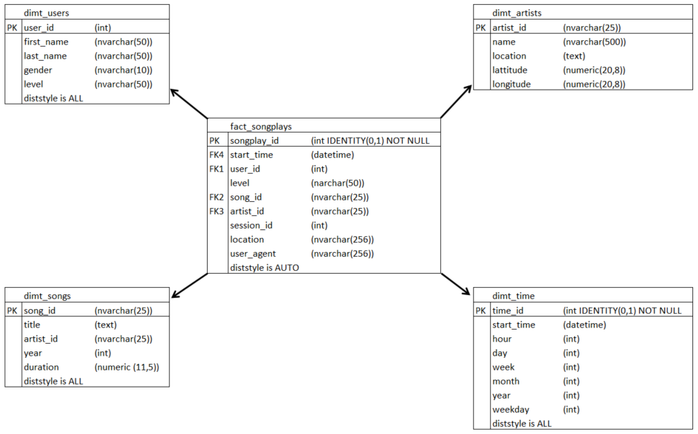
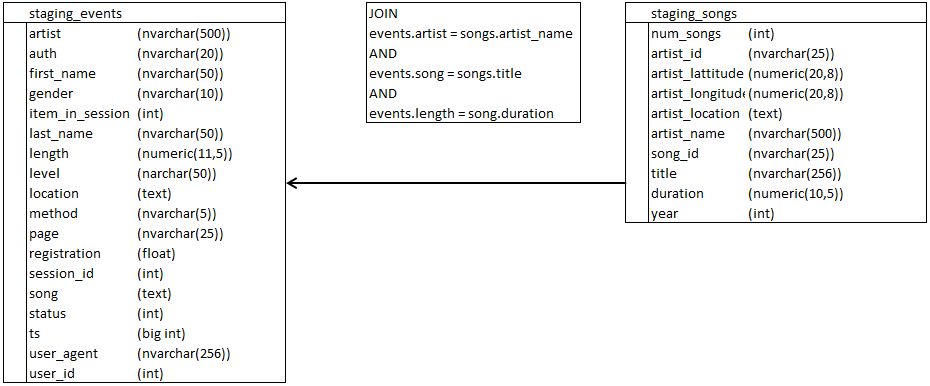

# Project: Data Warehouse

## 1. Purpose of this database
The startup Sparkify load their data onto a Redshift data warehouse for better analytical analysis.
Their data resides in S3, in a directory of JSON logs on user activity on the app, as well as a directory with JSON metadata on the songs in their app.
An ETL pipeline extracts the data from S3, stages them in Redshift, and transforms data into a set of dimensional tables for their analytics team to continue finding insights in what songs their users are listening to.

## 2. How to run the Python scripts
1. Create a redshift cluster with AWS front page or with Infrastructure-as-code script.
2. Running "create_tables.py" and checking the table schema in your redshift database. You can use Query Editor in the AWS Redshift console for this.
3. Running "etl.py".
4. Running the analytic queries on your Redshift database to compare your results with the expected results.

## 3. Explanation of the files in the repository
1. create_tables.py -> Script to create and drop the tables in the database
2. sql_queries.py -> Script with all SQL queries
3. etl.py -> Script to run the ETL
4. dwh.cfg -> Config file to connect to AWS
5. README.md -> Read me file

## 4. Database schema design and ETL pipeline

### Design schema for the fact and dimension tables
The schema of the fact and dimension tables is a star schema.
The fact table includes the numerical measures of activities and the dimension tables include items which describe characteristics of the measures.

### Relation of staging tables
There are two staging tables for the raw data from json files.
With the staging tables it is possible to get a good overview of the data quality and consistency.

### ETL pipeline
JSON files are extracted from S3 buckets copied to the staging tables staging_songs and staging_events.
For transformation SQL INSERT is used to get the data into the tables.
